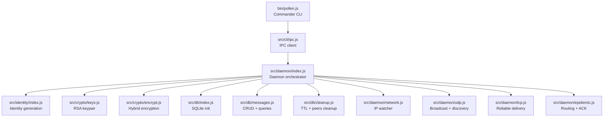
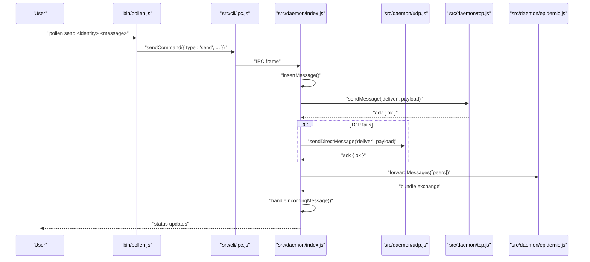
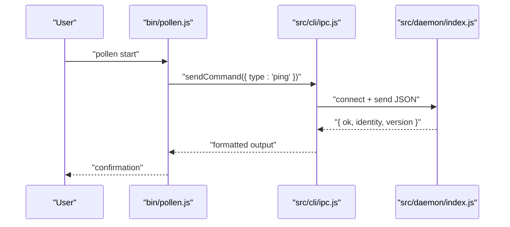
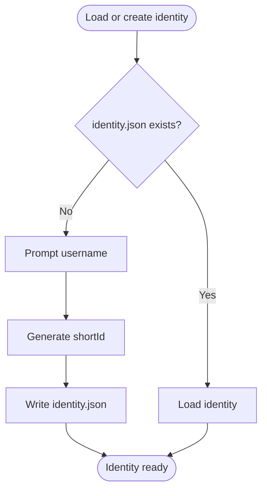
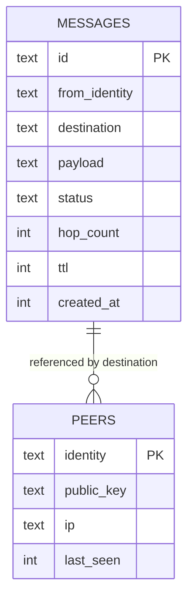
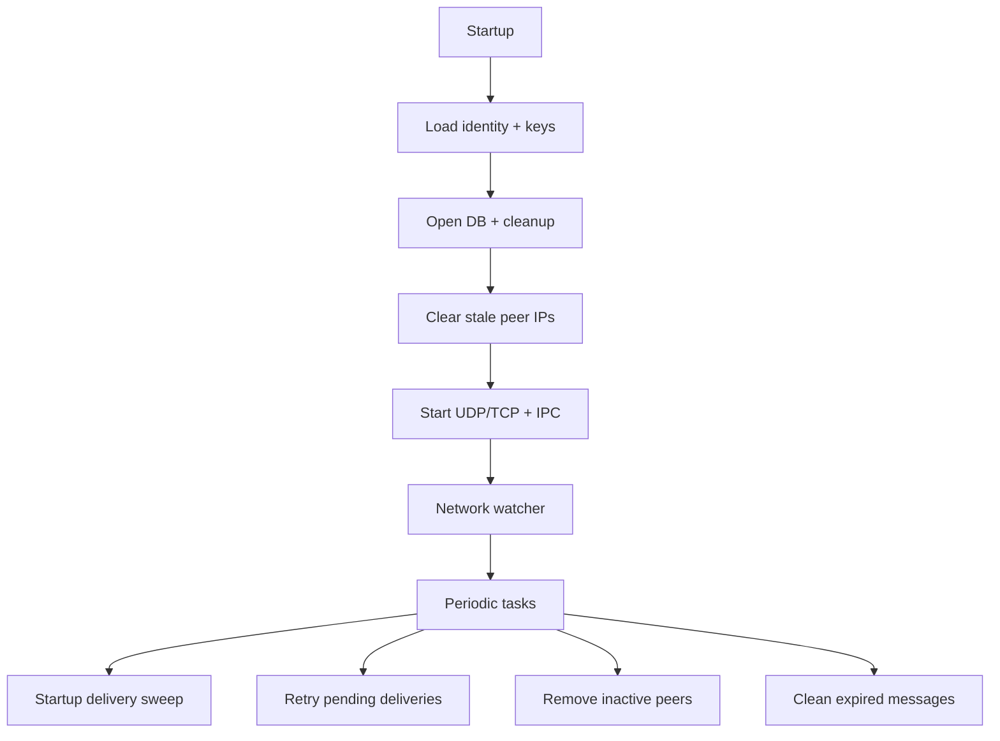
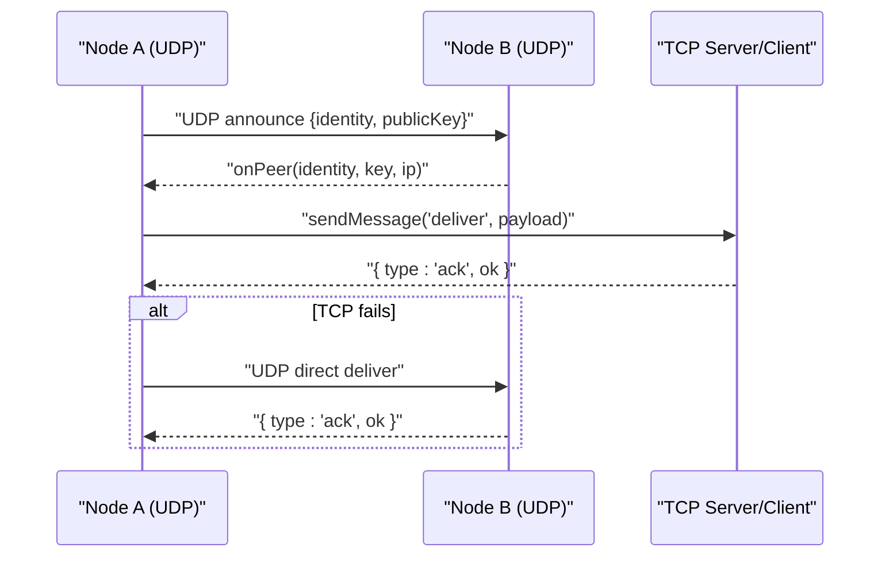
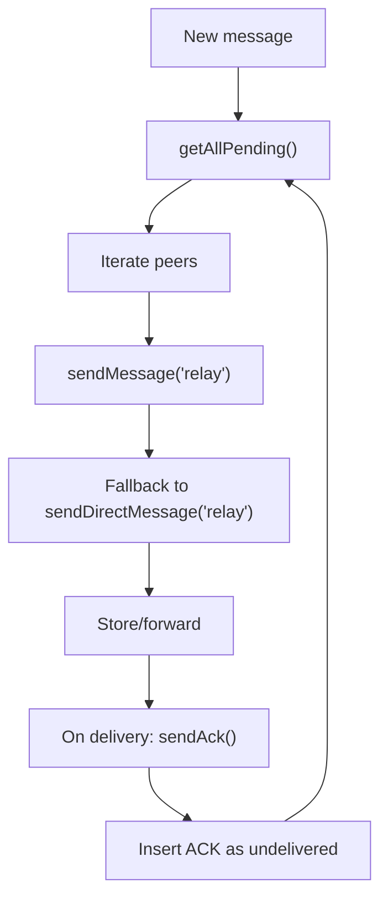
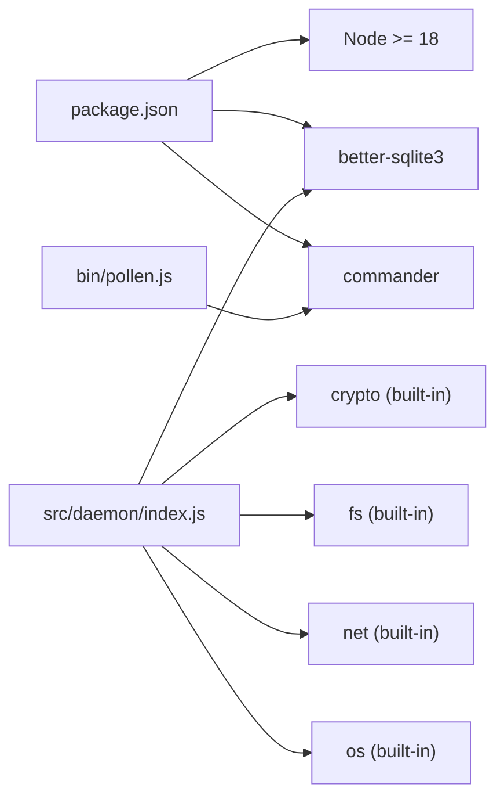

# Development and Contributing

<cite>
**Referenced Files in This Document**
- [README.md](file://README.md)
- [guide.md](file://guide.md)
- [roadmap.md](file://roadmap.md)
- [package.json](file://package.json)
- [bin/pollen.js](file://bin/pollen.js)
- [src/identity/index.js](file://src/identity/index.js)
- [src/crypto/keys.js](file://src/crypto/keys.js)
- [src/crypto/encrypt.js](file://src/crypto/encrypt.js)
- [src/db/index.js](file://src/db/index.js)
- [src/db/messages.js](file://src/db/messages.js)
- [src/db/cleanup.js](file://src/db/cleanup.js)
- [src/daemon/index.js](file://src/daemon/index.js)
- [src/daemon/network.js](file://src/daemon/network.js)
- [src/daemon/udp.js](file://src/daemon/udp.js)
- [src/daemon/tcp.js](file://src/daemon/tcp.js)
- [src/daemon/epidemic.js](file://src/daemon/epidemic.js)
- [src/cli/ipc.js](file://src/cli/ipc.js)
- [src/cli/commands/start.js](file://src/cli/commands/start.js)
- [src/cli/commands/send.js](file://src/cli/commands/send.js)
- [src/cli/commands/stop.js](file://src/cli/commands/stop.js)
- [src/cli/commands/scan.js](file://src/cli/commands/scan.js)
- [src/cli/commands/status.js](file://src/cli/commands/status.js)
- [src/cli/commands/sync.js](file://src/cli/commands/sync.js)
- [src/cli/commands/file.js](file://src/cli/commands/file.js)
</cite>

## Table of Contents
1. [Introduction](#introduction)
2. [Project Structure](#project-structure)
3. [Core Components](#core-components)
4. [Architecture Overview](#architecture-overview)
5. [Detailed Component Analysis](#detailed-component-analysis)
6. [Dependency Analysis](#dependency-analysis)
7. [Performance Considerations](#performance-considerations)
8. [Troubleshooting Guide](#troubleshooting-guide)
9. [Contribution Guidelines](#contribution-guidelines)
10. [Testing and Quality Assurance](#testing-and-quality-assurance)
11. [Release Procedures and Versioning](#release-procedures-and-versioning)
12. [Licensing and Intellectual Property](#licensing-and-intellectual-property)
13. [Conclusion](#conclusion)

## Introduction
This document is the definitive guide for developing and contributing to the Pollen project. It covers:
- Setting up a development environment across platforms
- Understanding the codebase, architecture, and development phases
- Coding conventions, testing strategies, and contribution workflows
- Issue reporting, code review processes, and feature requests
- Continuous integration, quality assurance, and release/versioning practices
- Licensing and IP policies

Pollen is a fully offline, zero-internet, peer-to-peer epidemic routing CLI messenger. It uses a daemon process, IPC, SQLite, and native networking to deliver messages without requiring the internet.

## Project Structure
At a high level, Pollen consists of:
- CLI entrypoint that delegates to the daemon via IPC
- A daemon that orchestrates identity, cryptography, database, and networking
- Modular subsystems for identity, crypto, DB, networking (UDP/TCP), epidemic routing, and CLI commands

**Diagram sources**
- [bin/pollen.js](file://bin/pollen.js#L1-L99)
- [src/cli/ipc.js](file://src/cli/ipc.js#L1-L128)
- [src/daemon/index.js](file://src/daemon/index.js#L1-L684)
- [src/identity/index.js](file://src/identity/index.js#L1-L101)
- [src/crypto/keys.js](file://src/crypto/keys.js#L1-L78)
- [src/crypto/encrypt.js](file://src/crypto/encrypt.js#L1-L101)
- [src/db/index.js](file://src/db/index.js#L1-L75)
- [src/db/messages.js](file://src/db/messages.js#L1-L214)
- [src/db/cleanup.js](file://src/db/cleanup.js#L1-L44)
- [src/daemon/network.js](file://src/daemon/network.js#L1-L50)
- [src/daemon/udp.js](file://src/daemon/udp.js#L1-L283)
- [src/daemon/tcp.js](file://src/daemon/tcp.js#L1-L201)
- [src/daemon/epidemic.js](file://src/daemon/epidemic.js#L1-L104)

**Section sources**
- [README.md](file://README.md#L91-L115)
- [roadmap.md](file://roadmap.md#L18-L49)

## Core Components
- Identity: Generates and persists a user identity and short ID; used by both CLI and daemon.
- Cryptography: RSA-2048 keypair generation and hybrid encryption (AES-256-GCM + RSA-OAEP).
- Database: SQLite via better-sqlite3 with WAL mode and foreign keys; stores messages and peers.
- Daemon: Orchestrates logging, IPC, networking, and message lifecycle.
- Networking: UDP broadcast for discovery and fallback delivery; TCP for reliable delivery and ACKs.
- CLI: Commands for start/stop/scan/send/status/sync/file; IPC to daemon.

**Section sources**
- [src/identity/index.js](file://src/identity/index.js#L1-L101)
- [src/crypto/keys.js](file://src/crypto/keys.js#L1-L78)
- [src/crypto/encrypt.js](file://src/crypto/encrypt.js#L1-L101)
- [src/db/index.js](file://src/db/index.js#L1-L75)
- [src/db/messages.js](file://src/db/messages.js#L1-L214)
- [src/daemon/index.js](file://src/daemon/index.js#L1-L684)
- [src/daemon/udp.js](file://src/daemon/udp.js#L1-L283)
- [src/daemon/tcp.js](file://src/daemon/tcp.js#L1-L201)
- [src/daemon/epidemic.js](file://src/daemon/epidemic.js#L1-L104)
- [bin/pollen.js](file://bin/pollen.js#L1-L99)

## Architecture Overview
Pollen’s runtime architecture:
- CLI runs user commands and forwards IPC to the daemon
- Daemon manages identity, keys, DB, and networking
- UDP/TCP handle discovery and delivery; epidemic routing spreads messages across networks
- ACKs travel back along the epidemic path to confirm delivery

**Diagram sources**
- [bin/pollen.js](file://bin/pollen.js#L54-L60)
- [src/cli/ipc.js](file://src/cli/ipc.js#L1-L128)
- [src/daemon/index.js](file://src/daemon/index.js#L526-L580)
- [src/daemon/tcp.js](file://src/daemon/tcp.js#L125-L198)
- [src/daemon/udp.js](file://src/daemon/udp.js#L109-L135)
- [src/daemon/epidemic.js](file://src/daemon/epidemic.js#L18-L57)

## Detailed Component Analysis

### CLI and IPC
- bin/pollen.js wires commands to handlers and exposes help and version.
- src/cli/ipc.js encapsulates IPC: sendCommand, runCommand, isDaemonRunning.
- CLI commands delegate to the daemon via IPC; they do not perform networking themselves.

**Diagram sources**
- [bin/pollen.js](file://bin/pollen.js#L21-L98)
- [src/cli/ipc.js](file://src/cli/ipc.js#L1-L128)
- [src/daemon/index.js](file://src/daemon/index.js#L488-L500)

**Section sources**
- [bin/pollen.js](file://bin/pollen.js#L1-L99)
- [src/cli/ipc.js](file://src/cli/ipc.js#L1-L128)
- [src/cli/commands/start.js](file://src/cli/commands/start.js#L79-L124)
- [src/cli/commands/stop.js](file://src/cli/commands/stop.js#L1-L16)
- [src/cli/commands/scan.js](file://src/cli/commands/scan.js#L1-L51)
- [src/cli/commands/status.js](file://src/cli/commands/status.js#L1-L44)
- [src/cli/commands/sync.js](file://src/cli/commands/sync.js#L1-L32)
- [src/cli/commands/send.js](file://src/cli/commands/send.js#L1-L115)
- [src/cli/commands/file.js](file://src/cli/commands/file.js#L1-L22)

### Identity and Keys
- Identity: generates a username@shortId and persists to identity.json.
- Keys: generates RSA-2048 keypair, stores public.pem and private.pem with appropriate permissions.

**Diagram sources**
- [src/identity/index.js](file://src/identity/index.js#L61-L86)

**Section sources**
- [src/identity/index.js](file://src/identity/index.js#L1-L101)
- [src/crypto/keys.js](file://src/crypto/keys.js#L29-L48)

### Database Schema and Operations
- SQLite with WAL and foreign keys; tables: messages and peers.
- CRUD and queries for messages and peers; TTL cleanup and stale peer removal.

**Diagram sources**
- [src/db/index.js](file://src/db/index.js#L28-L50)
- [src/db/messages.js](file://src/db/messages.js#L8-L29)

**Section sources**
- [src/db/index.js](file://src/db/index.js#L1-L75)
- [src/db/messages.js](file://src/db/messages.js#L1-L214)
- [src/db/cleanup.js](file://src/db/cleanup.js#L1-L44)

### Daemon Orchestration
- Loads identity and keys, opens DB, clears stale IPs, sets up IPC server.
- Handles incoming messages (direct and relay), attempts delivery, and triggers epidemic forwarding.
- Periodic tasks: startup sweep, retry sweep, stale peer cleanup, TTL cleanup.

**Diagram sources**
- [src/daemon/index.js](file://src/daemon/index.js#L76-L96)
- [src/daemon/index.js](file://src/daemon/index.js#L369-L447)

**Section sources**
- [src/daemon/index.js](file://src/daemon/index.js#L1-L684)

### Networking: UDP Discovery and TCP Delivery
- UDP: computes broadcast addresses, sends periodic announces, handles goodbye, and direct/relay frames.
- TCP: server accepts connections, parses newline-delimited JSON frames, responds with ACKs.

**Diagram sources**
- [src/daemon/udp.js](file://src/daemon/udp.js#L154-L250)
- [src/daemon/tcp.js](file://src/daemon/tcp.js#L16-L40)
- [src/daemon/tcp.js](file://src/daemon/tcp.js#L125-L198)

**Section sources**
- [src/daemon/udp.js](file://src/daemon/udp.js#L1-L283)
- [src/daemon/tcp.js](file://src/daemon/tcp.js#L1-L201)

### Epidemic Routing and ACKs
- forwardMessages: sends all pending messages to peers via TCP, with UDP fallback.
- sendAck: constructs and enqueues an ACK message that spreads via epidemic routing.

**Diagram sources**
- [src/daemon/epidemic.js](file://src/daemon/epidemic.js#L18-L57)
- [src/daemon/epidemic.js](file://src/daemon/epidemic.js#L69-L101)

**Section sources**
- [src/daemon/epidemic.js](file://src/daemon/epidemic.js#L1-L104)

## Dependency Analysis
- Runtime dependencies: better-sqlite3 (database), commander (CLI).
- Engines: Node.js >= 18 required (for crypto.randomUUID).
- Native addon: better-sqlite3 requires a C++ build toolchain depending on platform.

**Diagram sources**
- [package.json](file://package.json#L12-L18)
- [bin/pollen.js](file://bin/pollen.js#L10-L17)
- [src/daemon/index.js](file://src/daemon/index.js#L13-L61)

**Section sources**
- [package.json](file://package.json#L1-L28)
- [README.md](file://README.md#L24-L34)

## Performance Considerations
- SQLite WAL mode improves concurrent reads.
- Foreign keys enforced for referential integrity.
- Timers and intervals tuned for reliability and resource usage:
  - UDP broadcast: 15s
  - Network watcher: 15s
  - Delivery retry sweep: 30s
  - Stale peer cleanup: 60s
  - TTL cleanup: hourly
- TCP inactivity timeout: 30s; IPC response timeout: 5s; TCP connect/send timeouts: 2s/8s.

**Section sources**
- [src/db/index.js](file://src/db/index.js#L23-L25)
- [roadmap.md](file://roadmap.md#L589-L602)
- [src/daemon/tcp.js](file://src/daemon/tcp.js#L7-L8)
- [src/daemon/index.js](file://src/daemon/index.js#L418-L436)

## Troubleshooting Guide
Common issues and remedies:
- Node.js version: ensure Node >= 18.
- Native build tools: install platform-specific build tools and Python as required by better-sqlite3.
- Port conflicts: UDP 41234 and TCP 41235 must be free; the daemon logs when ports are in use.
- IPC connectivity: verify the daemon is running and responsive; check ~/.pollen/daemon.log.
- Permissions: private key file uses restricted permissions on Unix-like systems.
- Network changes: the daemon re-broadcasts and retries on IP changes.

**Section sources**
- [README.md](file://README.md#L24-L34)
- [src/daemon/tcp.js](file://src/daemon/tcp.js#L32-L36)
- [src/crypto/keys.js](file://src/crypto/keys.js#L43-L44)
- [src/daemon/index.js](file://src/daemon/index.js#L356-L367)

## Contribution Guidelines
How to contribute effectively:
- Align with the roadmap phases:
  - Phase 1: Foundation (daemon, identity, crypto, IPC, SQLite) — complete
  - Phase 2: UDP discovery and LAN send/receive — next
  - Phase 3: Store-and-forward DTN
  - Phase 4: Full epidemic routing + ACK
  - Phase 5: File transfer
- Choose work scoped to a phase; start with Phase 2 features.
- Follow existing patterns:
  - Single responsibility per module
  - Built-in Node modules for networking and crypto
  - IPC via Unix socket/Windows named pipe
  - Hybrid encryption for confidentiality and authenticity
  - SQLite for persistence with WAL and foreign keys
- Submit issues and feature requests using the repository’s issue tracker; include:
  - Expected vs. actual behavior
  - Steps to reproduce
  - Environment details (Node version, OS)
  - Logs from ~/.pollen/daemon.log when relevant

Code review checklist:
- Tests pass locally
- No global state mutations
- Proper error handling and logging
- IPC and network timeouts documented and handled
- Security: encryption and key handling follow the hybrid model

**Section sources**
- [README.md](file://README.md#L167-L176)
- [roadmap.md](file://roadmap.md#L522-L534)

## Testing and Quality Assurance
Current state:
- No dedicated test suite is present in the repository.
- Recommended approach:
  - Unit tests for identity, crypto, DB helpers, and CLI IPC
  - Integration tests for daemon lifecycle and message delivery
  - End-to-end tests simulating UDP/TCP exchanges and epidemic forwarding
- CI setup (recommended):
  - Node.js LTS matrix builds
  - Platform-specific steps for native addon compilation
  - Linting and basic smoke tests

Guidance:
- Use Node’s built-in assert or a minimal assertion library for unit tests.
- For integration tests, spawn the daemon, exercise IPC, and verify DB state and logs.
- For end-to-end tests, simulate LAN environments with loopback and multiple daemons.

**Section sources**
- [src/identity/index.js](file://src/identity/index.js#L1-L101)
- [src/crypto/encrypt.js](file://src/crypto/encrypt.js#L1-L101)
- [src/db/messages.js](file://src/db/messages.js#L1-L214)
- [src/cli/ipc.js](file://src/cli/ipc.js#L1-L128)
- [src/daemon/index.js](file://src/daemon/index.js#L1-L684)

## Release Procedures and Versioning
Versioning strategy:
- Semantic versioning (patch/minor/major) aligned with feature completeness and breaking changes.
- Increment patch for bug fixes; minor for new features within roadmap phases; major for incompatible changes.

Release checklist:
- Update version in package.json
- Verify Node >= 18 compatibility
- Confirm native addon builds on target platforms
- Publish to npm registry
- Tag and release on the repository

Deployment:
- Global installable via npm; ensure PATH and permissions are correct on Unix-like systems.

**Section sources**
- [package.json](file://package.json#L3-L3)
- [README.md](file://README.md#L37-L43)

## Licensing and Intellectual Property
- License: MIT
- Contributors must agree to license their contributions under the project’s license.
- No separate Contributor License Agreement is present in the repository.

Intellectual property considerations:
- RSA-2048 and AES-256-GCM are standard cryptographic primitives used per the implementation.
- Hybrid encryption model protects message content against relay nodes.

**Section sources**
- [package.json](file://package.json#L27-L27)
- [README.md](file://README.md#L179-L182)

## Conclusion
By following this guide, new contributors can quickly set up a development environment, understand the architecture, and contribute meaningfully aligned with the roadmap. Experienced developers can leverage the modular design and established patterns to implement Phase 2 and beyond. Adhering to the contribution guidelines, testing recommendations, and release procedures will help maintain quality and continuity.